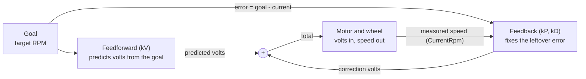

# PID Tuning Guide for New Developers

Last updated 2026-10-03. Shared version (with a drawn diagram):
https://claude.ai/code/artifact/d8f79e44-7502-41c9-b5cc-1122cedb06e2

## What PID is

PID is a loop that runs every 20 ms. It compares where a mechanism *is* to where we *want* it, then decides how hard to push. That comparison is the **error**:

```
error = goal - current
```

Think of driving a car toward a stop sign. You push the pedal based on how far away the sign is, and ease off as you get close. Each letter in PID is one way of turning the error into motor output.

| Term | Our Preference name | What it does | Car analogy |
| --- | --- | --- | --- |
| **Feedforward** | `kV` | Pushes the amount we *predict* is needed for the goal, before any error exists | You know about how much pedal it takes to hold 30 mph |
| **P** (proportional) | `kP` | Pushes in proportion to the error: big error, big push | Far from the sign, press harder; close, press lighter |
| **D** (derivative) | `kD` | Pushes against fast changes in error, which damps overshoot | Easing off because you're closing in fast |
| **I** (integral) | `kI` | Adds up error over time to remove a small leftover gap | We don't use it (see below) |

**Feedforward does most of the work.** For a spinning wheel like a shooter, kV alone gets close to the target speed. P only cleans up the small gap that's left.

**We don't use I.** It keeps adding up error while the mechanism is blocked or saturated, then overshoots badly when it's released. This is called *integral windup*. Team rule (CLAUDE.md): leave `kI` at 0.

## Feedforward: predict first, correct second

Feedforward is the motor output we can **predict** from the goal alone, before measuring anything. Feedback (P and D) only **corrects** whatever error the prediction leaves.

You already do this. To carry a full backpack, you lean forward before you start walking. You don't wait to fall backwards and then fix it. Leaning first is feedforward. Small adjustments as you walk are feedback.

### The kV formula

A motor's speed is roughly proportional to the voltage you give it. So the voltage needed for a target speed is roughly:

```
V_feedforward = kV × target speed
```

kV is just "volts per unit of speed." You can estimate it from the motor's free speed:

| Motor | Free speed at 12 V | kV estimate |
| --- | --- | --- |
| NEO (shooter, ball path) | 5676 RPM | 12 ÷ 5676 ≈ 0.0021 V per RPM |
| Kraken X60 (swerve drive) | 6000 RPM = 100 rotations/s | 12 ÷ 100 = 0.12 V per rotation/s |

Our swerve drive uses `DRIVE_KV = 0.124`, almost exactly the estimate. That's what a well-tuned kV looks like.

**Example:** to spin a NEO at 3000 RPM, feedforward gives 0.0021 × 3000 ≈ 6.3 V. Real mechanisms have friction and load, so the wheel lands a bit under 3000. kP then adds a little more voltage to close that gap.

### Why it matters

- **Feedback alone has to be wrong first.** P only pushes when there's error. With no feedforward, the mechanism always sits a little short of its goal: just enough error for P to produce the voltage it needs.
- **Feedforward reacts instantly.** When the goal changes from 1000 to 3300 RPM, feedforward jumps right away. P waits for the error to grow.
- **It keeps P small.** If feedforward does 90% of the work, P only handles 10%. A small P is much less likely to oscillate.

### Other feedforward terms

kV is the only feedforward term for our shooter and ball path. You'll see others:

| Term | Covers | Where we use it |
| --- | --- | --- |
| `kS` (static) | The minimum voltage to overcome friction and start moving | Swerve steer motors (`TURN_KS = 0.1`) |
| `kV` (velocity) | Voltage proportional to speed | Shooter, ball path, swerve drive and steer |
| `kA` (acceleration) | Extra voltage while speeding up | Not used (0) |
| `kG` (gravity) | Voltage to hold an arm or elevator up against gravity | No arm on this robot |

The full prediction is the sum: kS + kV × speed + kA × acceleration (+ kG for an arm).

Our shooter is the exception that proves the rule. Its kV (0.0002) is about a tenth of the estimate, so P does most of the work. The team tried a kV-first tune and couldn't get it working, so this is deliberate (see the worked example below).

### Feedforward predicts, feedback corrects, and the motor gets the sum



Feedforward only looks at the goal. Feedback only looks at the error, so it needs the measured speed coming back around the loop.

## Where PID lives in our code

Most gains a new developer will touch are Preferences declared in `Config.java`, so they can be changed from the dashboard. The swerve motor gains and the PathPlanner gains are the exceptions: they're constants in code and need a redeploy.

| Mechanism | Gains | Defined in | Change live? | New value takes effect |
| --- | --- | --- | --- | --- |
| Shooter wheel | `ShooterSubsystem/ShooterMotor/kV`, `kP`, `kD` | `Config.Shooter.shooterPid` | Yes | Next time a shooter command starts (gains are pushed to the SPARK in `resetPid()`) |
| Intake, feeder, agitator | `BallPathSubsystem/<Motor>/kV`, `kP`, `kD` | `Config.BallPath` | Yes | Next time a ball-path command starts |
| Turn to heading, drive to pose | `SwerveAuto/RotationKp`, `SwerveAuto/TranslationKp` | `Config.SwerveAuto` | Yes | Immediately (read every loop) |
| PathPlanner path following | Translation and rotation P, both **1.0** | `AutonomousSubsystem.java` line 139 | No | After redeploy. Hardcoded on purpose while tuning autos (March 2026). The `PathPlanner/.../kP` Preferences are leftovers and do nothing |
| Swerve drive and steer motors | `DRIVE_KP`, `DRIVE_KV`, `TURN_KP`, `TURN_KD`, `TURN_KS`, `TURN_KV` | `SwerveHardwareConfig.java` | No | After redeploy. Already tuned; leave alone unless a mentor asks |

The SPARK motor controllers (shooter, ball path) run their PID loop on the controller itself at 1 kHz. Our code only sends them the gains and the target RPM. The `SwerveAuto` gains run in our own Java code, in `SwerveToHeadingCommand` and `SwerveToPoseCommand`.

## Changing gains from the dashboard

You can tune without redeploying. Edit the Preference in Elastic, then restart the command so the new gain is used.

1. Connect the laptop to the robot and open **Elastic** (or Shuffleboard).
2. Open the **Preferences** table and find the gain, for example `ShooterSubsystem/ShooterMotor/kP`.
3. Type the new value and press Enter.
4. **Release the button and press it again.** Shooter and ball-path gains only reach the motor controller when a command starts.
5. Watch the numbers below and repeat.

What to watch for each mechanism:

| Mechanism | Watch these values | Good looks like |
| --- | --- | --- |
| Shooter | `ShooterSubsystem/ShooterMotor/CurrentRpm`, `DesiredRpm`, `ErrorRpm`, `AtSpeed?` | ErrorRpm settles near 0 in under ~1 s; AtSpeed? turns true and stays true |
| Ball path | `BallPathSubsystem/<Motor>/CurrentRpm`, `DesiredRpm`, `ErrorRpm` | Same as shooter |
| Turn to heading | `HeadingCurrent`, `HeadingGoal`, `HeadingError`, `VelocityFeedback` | Turns to the goal and stops without swinging past it |

Graph CurrentRpm and DesiredRpm on the same Elastic graph widget. Overshoot and oscillation are much easier to see as a line than as a changing number.

**Preferences are saved on the robot.** A value you type stays there across reboots and redeploys. Changing the default in `Config.java` does **not** replace a value already saved on the robot (see the last section).

## The tuning recipe

Always tune in this order: **kV first, then kP, then kD only if needed.** Change one gain at a time, and write down every value you try.

**Before you start:**

- [ ] A mentor or experienced student is with you
- [ ] The robot is on blocks, or the mechanism has clear space
- [ ] Someone has a finger on the Driver Station disable key (**spacebar**)
- [ ] Battery is charged (a weak battery makes every gain look wrong)
- [ ] You've written down the current gains so you can put them back

**Steps:**

1. **Zero the feedback.** Set kP and kD to 0. Now only feedforward is acting.
2. **Tune kV.** Run the mechanism at its normal speed and watch CurrentRpm.
    - A good starting kV for a NEO is 12 V / 5676 RPM ≈ **0.0021**.
    - Adjust kV until CurrentRpm reaches about 80–95% of DesiredRpm.
    - Too slow → raise kV a little. Faster than desired → lower it.
3. **Add kP.** Start very small (try 0.0001), then double it each try.
    - Stop when CurrentRpm reaches DesiredRpm quickly and holds steady.
    - If RPM starts bouncing above and below the goal, or the motor buzzes, kP is too high. Go back to the last good value.
4. **Add kD only if needed.** If the best kP still overshoots, try a tiny kD (0.00001). Most flywheels don't need it.
5. **Leave kI at 0.**
6. **Test the real use.** Run it the way a match would: spin up, shoot several balls in a row, spin up again. Make sure it recovers between shots.
7. **Save the values into code** (last section).

REV gains are very small numbers. A kP of 0.001 with a 1000 RPM error is already full power. Change values in small steps.

## Worked example: the shooter

The shooter is a single NEO on a SPARK MAX. It targets **3300 RPM** to shoot (`Shooter/ShootRpm`) and **1000 RPM** to idle (`Shooter/IntakeRpm`). On the driver controller, the right trigger shoots and the left trigger intakes.

Current gains:

| Preference | Value now |
| --- | --- |
| `ShooterSubsystem/ShooterMotor/kV` | 0.0002 |
| `ShooterSubsystem/ShooterMotor/kP` | 0.002 |
| `ShooterSubsystem/ShooterMotor/kD` | 0 |

A tuning session might go like this:

1. Note the three values above. Set kP to 0.
2. Hold the right trigger. With kV = 0.0002 alone, CurrentRpm will sit far below 3300. That's because 0.0002 × 3300 is only about 0.7 V, and the wheel needs roughly 7 V.
3. Raise kV toward 0.0021 in steps (0.001, 0.0015, 0.002). Release and press the trigger after each change. Stop when CurrentRpm is about 2900–3200.
4. Set kP to 0.0001, then double it each try. Watch the graph: CurrentRpm should climb to the 3300 line and stay flat.
5. Check `AtSpeed?`. It turns true within 100 RPM of the goal (`Shooter/ShootSpeedTolerance`).
6. Shoot five balls in a row. Each shot slows the wheel. It should get back to speed before the next ball is fed.
7. Do the same check at 1000 RPM idle (left trigger).

The shooter is tuned mostly on kP **on purpose**: kV is about a tenth of the 0.0021 estimate. The team couldn't get a kV-first tune working on this shooter, and the autos were tuned with the current values. Use the steps above for new mechanisms or practice. Don't change the shooter gains without a mentor and a re-check of the autos.

## Common problems and saving your work

| What you see | Likely cause | Try |
| --- | --- | --- |
| Never reaches the goal; stops a fixed amount short | kV too low, kP too low | Raise kV first, then kP |
| RPM bounces above and below the goal; motor buzzes | kP too high | Halve kP; add a tiny kD only if halving makes it too slow |
| Shoots past the goal, then settles | kP a bit high, or kV too high | Lower kV slightly, then kP |
| Takes several seconds to get there | Gains too low overall | Raise kV, then kP |
| You changed a gain and nothing happened | Command didn't restart, or the gain isn't a Preference | Release and press the button again; check the table in "Where PID lives" |
| Same gains behave differently today | Low battery, or something mechanical (friction, belt, jam) | Charge the battery; check the mechanism by hand |

### Saving tuned values into code

A value typed in Elastic lives only on that roboRIO. To make it permanent for everyone, copy it into `Config.java`:

```java
// Config.java, interface Shooter
PIDFConfig shooterPid = new PIDFConfig("ShooterSubsystem/ShooterMotor",
        0.0004,   // kP
        0.0,      // kI - always 0
        0.0,      // kIZone
        0.0,      // kD
        0.0020);  // kV
```

The arguments are in the order **kP, kI, kIZone, kD, kV**. Note it: kV is last, not first.

Then commit it and say in the commit message what you tuned and how it behaved.

One catch: `Preferences.initDouble` only writes the default when no value is saved yet. A robot that already has a saved value keeps it, even after you deploy new defaults. To get the new default onto that robot, delete that key from the Preferences table in Elastic and restart robot code.
